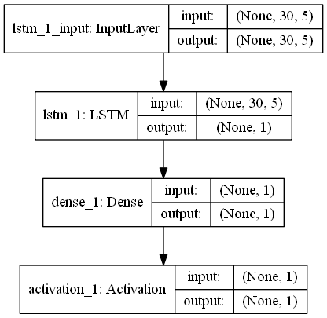

## BitCollector 

1. `btc.csv`: 비트코인 csv파일
2. `etc.csv`: 이더리움클래식 csv파일
3. `eth.csv`: 이더리움 csv파일
4. `xrp.csv`: 리플코인 csv파일

`bitcollector.py`: keras, tensorflow Backend RNN Python File

### 케라스 모델 (현)

